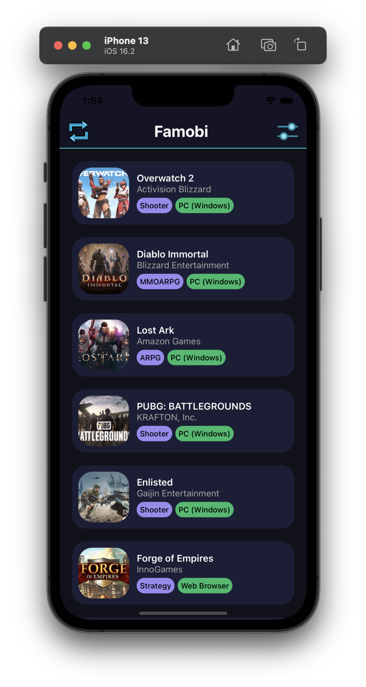
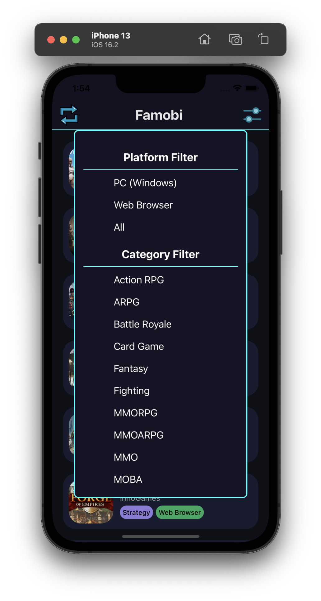
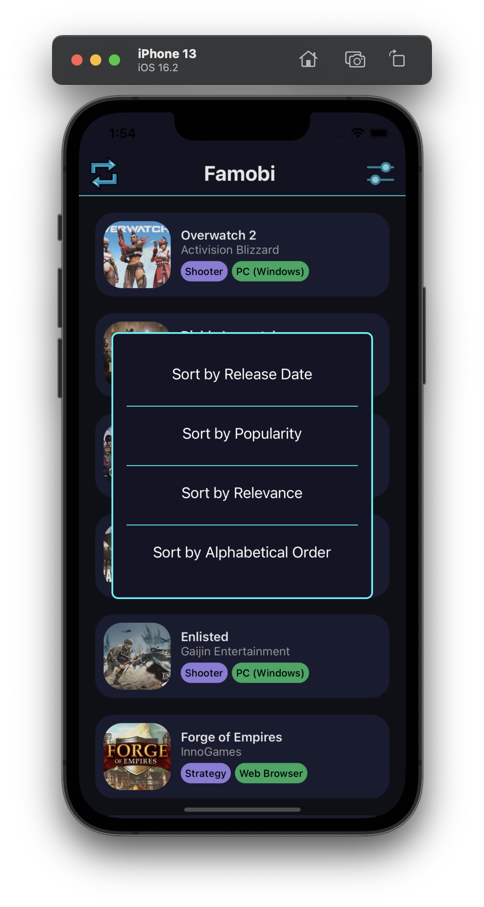
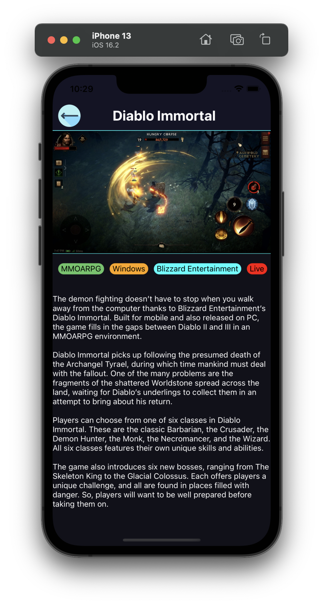

# Famobi Developer Test Project


Functionally does all the work as in the developer test pdf file. I also added a details page.

## Table of Contents

- [Getting Started](#getting-started)
- [Prerequisites](#prerequisites)
- [Installation](#installation)
- [ScreenShots](#screenshots)
- [Extra Problem](#extraproblem)
<br>

### Getting Started

These instructions will help you set up the project locally on your machine for development and testing purposes.

<br>

### Prerequisites

Before you begin, ensure that you have the following software installed:

- [Node.js](https://nodejs.org) 
- [npm](https://www.npmjs.com) (normally comes with Node.js)
- [React Native CLI](https://reactnative.dev/docs/environment-setup) (for running React Native projects)
<br>

### Installation

1. Clone the repository:

   ```bash
   git clone https://github.com/your-username/your-project.git

   cd FamobiTest

   npm install

   npm start
   # Run the project


<br>
<h3>Screenshots</h3>
<div class="row">
  <div class="column">




</div><br>

<br>

### Extra Problem

<br>

```javascript

  const progressStats = {
  "archery-mission-lvl": {
    "fails": 9,
    "gameId": "archery-world-tour",
    "playTime": 5291.706,
    "wins": 8,
  },
  "archery-world-mission-1": {
    "fails": 9,
    "gameId": "archery-world-tour",
    "playTime": 981,
    "wins": 6,
  },
  "bubble-woods-mission-1": {
    "fails": 19,
    "gameId": "bubble-woods",
    "playTime": 1206,
    "wins": 9,
  },
  "bubble-woods-mission-lvl": {
    "fails": 1,
    "gameId": "bubble-woods",
    "playTime": 100,
    "wins": 2,
  },
  "candy-bubble-mission-lvl": {
    "fails": 6,
    "gameId": "candy-bubble",
    "playTime": 1558,
    "wins": 6,
  }
};

const gameStatsArray = Object.values(progressStats).reduce((acc, mission) => {
  const { gameId, wins, fails, playTime } = mission;
  const existingGameStats = acc.find(stats => stats.gameId === gameId);

  if (existingGameStats) {
    existingGameStats.wins += wins;
    existingGameStats.fails += fails;
    existingGameStats.playTime += playTime;
  } else {
    acc.push({ gameId, wins, fails, playTime });
  }

  return acc;
}, []);

console.log(gameStatsArray);


   
